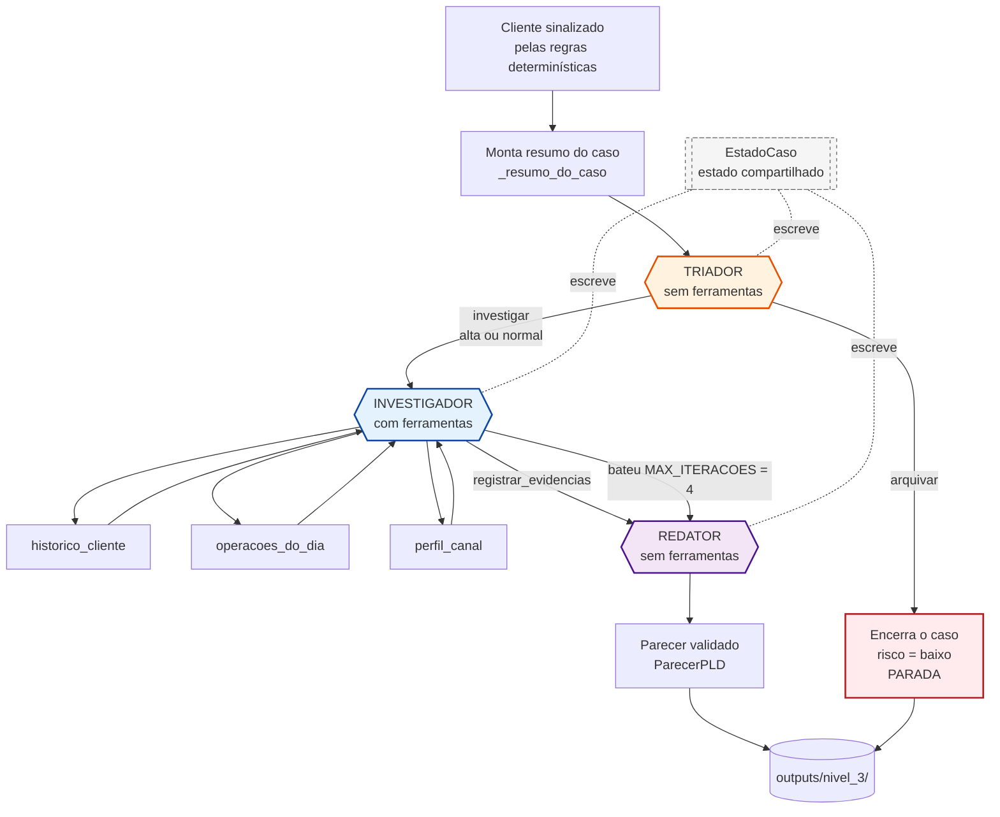

# Arquitetura do fluxo multiagente (Nível 3 — Trilha A)

## O diagrama



---

## Os três papéis

### Triador

**O que faz:** olha o resumo do caso e decide se vale investigar ou se pode arquivar.

**Ferramentas:** nenhuma, de propósito. Se ele pudesse consultar a base, viraria um segundo
investigador e a economia sumiria. Ele decide com o que já está na mesa.

**Saída:** `{decisao, motivo, prioridade}`.

**Detalhe importante:** se a resposta dele não puder ser lida, o fluxo **investiga por
padrão** em vez de arquivar. Errar pro lado do falso positivo custa tempo de analista;
arquivar por causa de um erro de parsing custa um caso não visto. Os dois erros não têm o
mesmo preço, então o comportamento em caso de falha não é simétrico.

### Investigador

**O que faz:** usa as ferramentas do Nível 2 para levantar os fatos. Não atribui risco e não
escreve parecer.

**Ferramentas:** as três de `nivel_2/tools.py`, **sem nenhuma alteração**, mais
`registrar_evidencias` para encerrar.

**Detalhe importante:** o prompt pede explicitamente que ele registre tanto o que sustenta
quanto o que **enfraquece** a suspeita. Isso é resposta direta ao que eu vi no Nível 2 —
como as regras geram falso positivo de propósito, evidência que derruba a hipótese é mais
valiosa que evidência que confirma.

### Redator

**O que faz:** pega as evidências e escreve o parecer final.

**Ferramentas:** nenhuma. Ele não consulta a base — trabalha só com o que o investigador
apurou. Isso é proposital: se ele pudesse consultar, poderia trazer número que não passou
pela investigação, e a evidência do parecer deixaria de ser rastreável.

**Saída:** validada pelo mesmo `ParecerPLD` do Nível 1, com o mesmo vocabulário fechado e a
mesma regra de coerência entre risco alto e red flags.

---

## Estado compartilhado

`EstadoCaso` é uma dataclass que acompanha o caso do começo ao fim. Cada papel escreve o seu
pedaço:

| Papel | O que escreve |
|---|---|
| Triador | `triagem_decisao`, `triagem_motivo`, `triagem_prioridade` |
| Investigador | `evidencias`, `ferramentas_chamadas`, `iteracoes_investigacao` |
| Redator | `nivel_risco`, `tipologia_suspeita`, `red_flags`, `justificativa` |
| Todos | `tokens_por_papel`, `latencia_por_papel` |

**Nenhum papel lê a saída bruta do anterior — todos leem o estado.** Isso mantém o
acoplamento entre eles no formato do `EstadoCaso`, e não no formato da resposta de um
modelo. Se eu trocar o modelo do triador amanhã, o investigador não precisa saber.

A telemetria é registrada **por papel**, não só no total. É isso que permite medir onde o
custo está e se o triador está se pagando.

---

## Condição de parada

Três pontos onde o fluxo termina:

1. **Triador arquiva** — encerra ali, não chama mais ninguém. É a parada que dá economia.
2. **Investigador bate `MAX_ITERACOES = 4`** — segue para o redator com o que conseguiu
   levantar. Não trava em loop.
3. **Redator conclui** — fim natural.

Falha de API em qualquer papel também encerra, com o status registrado.

---

## A hipótese que motivou a arquitetura — e o que a medição mostrou

A ideia era responder a um número que eu tinha medido no Nível 2: lá, **todo cliente recebe
investigação completa**, e 4 dos 6 casos concluídos saíram como risco baixo, cada um
custando entre 5.900 e 11.100 tokens de entrada. Gastei o fluxo inteiro em casos que o
próprio agente concluiu que não sustentavam suspeita.

O triador deveria atacar isso: caso arquivado custaria **uma chamada curta** em vez do fluxo
inteiro.

### Rodei, e não foi o que aconteceu

**O triador arquivou zero casos em cinco.** Ele mandou investigar todos.

E não é bug — é ele sendo conservador. Diante de "a regra foi acionada", com só o resumo do
caso e nenhuma ferramenta, a decisão segura é sempre investigar. **O que torna o triador
barato é o mesmo que o impede de arquivar.** Não percebi essa tensão quando desenhei.

Sem arquivamento, a economia não existe: o custo por caso ficou parecido ou maior que o do
agente único, com três chamadas em vez de uma.

Deixo a arquitetura como está e reporto o resultado. A análise completa — incluindo o
gargalo de informação entre investigador e redator, que me pareceu mais grave que o custo —
está no `DECISOES.md`, seção 10.

Ajustar o triador até ele arquivar alguma coisa só para mostrar economia seria medir o meu
ajuste, não a arquitetura.

---

## O trade-off que essa arquitetura cria

**Ganha:** papéis com responsabilidade separada, e o parecer fica rastreável — cada red flag
vem de uma evidência registrada, que veio de uma ferramenta. O ganho de custo nos casos
arquivados era o principal argumento, mas **não se materializou** porque o triador não
arquivou nenhum caso.

**Perde:** mais pontos de falha. São três chamadas em vez de uma, e cada uma pode falhar por
quota, validação ou formato. Nos casos que vão até o fim, a latência é maior.

**E tem um risco de qualidade que apareceu na prática, diferente do que eu antecipava.** Eu
esperava que o problema fosse o triador arquivar caso que merecia investigação — troca de
recall por custo. Na medição, o problema foi outro: **o redator só sabe o que o investigador
escreveu**. Três dos casos concluídos tiveram uma única evidência registrada, e o redator
não tinha base para nada além de "risco baixo". No `CLI-029`, o investigador deixou de
registrar os tipos das operações, que era o argumento decisivo, e o parecer saiu diferente
do que o agente único produziu com a mesma base.

Separar papéis dá rastreabilidade e cria um funil. Detalhes na seção 10 do `DECISOES.md`.

---

## Como rodar

```bash
cd nivel_3
python fluxo.py CLI-029      # um caso, com a trajetória impressa
python fluxo.py lote 5       # os 5 primeiros do ranking
```

Saídas em `outputs/nivel_3/`: um JSON por cliente com o `EstadoCaso` completo, e
`fluxo_multiagente.csv` com a tabela comparativa.
